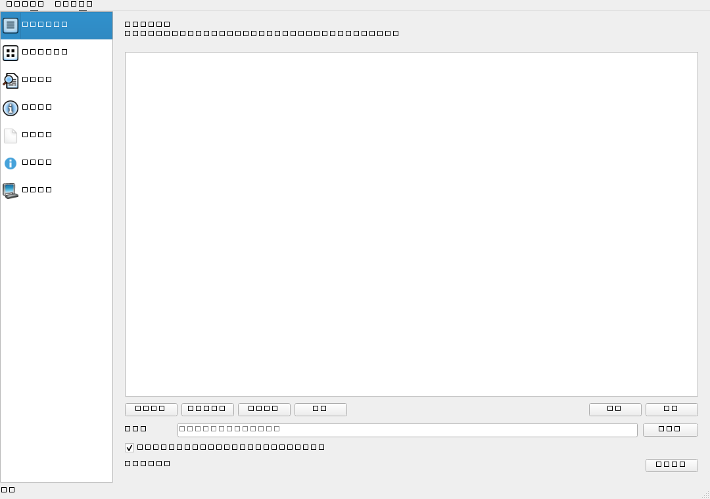

# PDFer

一个面向 Windows 的轻量级、免费开源 PDF 工具箱。很多常见 PDF 操作在现有软件里要么入口分散、流程不够直接，要么被放在会员功能中；PDFer 希望把这些高频操作集中到一个本地、开箱即用的小工具里。无需上传文件到网站，常用 PDF 操作都在本地完成。

> 当前版本：**0.1.0**
>
> 开源协议：**MIT**



## 下载

普通用户不需要安装 Python，也不需要下载源码。

前往 [GitHub Releases](https://github.com/yinhuaguang/PDFer/releases/latest) 下载：

```text
PDFer.exe
```

下载后直接双击运行即可。正式 Release 同时提供 SHA-256 校验文件。

> Windows SmartScreen 可能会提示“未知发布者”。PDFer 当前未购买商业代码签名证书；你可以通过 Release 中的 SHA-256 校验文件验证下载内容，也可以从源码自行构建。

## 功能

| 功能 | 说明 |
|---|---|
| 合并 PDF | 多文件合并、拖动排序、可为源文件生成书签 |
| 拆分 PDF | 按固定页数、单页、页码范围或书签拆分 |
| 页面管理 | 缩略图预览、旋转、删除、复制、拖动排序、导出所选页 |
| 提取内容 | 提取 PDF 内嵌图片或已有文字层 |
| PDF → 图片 | 导出 PNG / JPEG / WebP，可设置 DPI、质量和页码范围 |
| 图片 → PDF | 多张 PNG / JPEG / WebP / BMP / TIFF 按顺序合成为 PDF |
| 文档信息 | 查看页数、纸张尺寸、PDF 版本、加密状态、元数据等 |
| 优化压缩 | 无损重写 PDF 结构、压缩数据流、清理未引用资源 |
| 设置密码 | 使用 AES-256 为 PDF 设置打开密码 |
| 移除密码 | 在已知当前密码的前提下生成无密码副本 |

### 暂不加入 V0.1 的功能

PDFer 当前刻意不集成 OCR、PDF 转 Word、正文直接编辑、电子签名等重型能力。这些功能往往需要额外模型、Office/LibreOffice 组件或更复杂的 PDF 编辑引擎，会显著增加安装体积与维护成本。

## 为什么 EXE 有几十 MB？

PDFer 的业务源码本身很小，主要体积来自桌面运行时：

- **PySide6 / Qt**：图形界面运行库；
- **PDFium**：PDF 页面渲染；
- **Pillow**：图片解码与转换；
- **Python runtime**：让目标电脑无需预装 Python。

项目的 PyInstaller 配置已经排除了 Qt WebEngine、QML、Multimedia、Charts、SQL 等未使用组件，因此正式产物远小于完整 PySide6 安装环境。

单文件版本使用 PyInstaller onefile：依赖被压入 `PDFer.exe`，启动时临时解包到系统临时目录。它的优点是下载和使用简单，代价是冷启动会比目录版稍慢。

## 本地运行

要求 Python 3.10+。

```powershell
git clone https://github.com/yinhuaguang/PDFer.git
cd PDFer

python -m venv .venv
.\.venv\Scripts\Activate.ps1
python -m pip install -U pip
pip install -e ".[dev]"

python -m pdfer
```

## 测试

```powershell
pytest
```

项目将核心 PDF 操作与 Qt GUI 分离，核心层可以独立测试。

## 构建

### 单 EXE Release

```powershell
.\build.ps1
```

成功后生成：

```text
dist\PDFer.exe
```

这个文件可以直接复制到另一台 Windows 电脑运行，不要求预装 Python。

### 目录版

用于排障、检查 DLL 或需要更快冷启动时：

```powershell
.\build.ps1 -OneDir
```

生成：

```text
dist\PDFer\PDFer.exe
dist\PDFer\_internal\...
```

## 技术栈

- Python
- PySide6 / Qt
- pypdf
- pikepdf / qpdf
- pypdfium2 / PDFium
- Pillow
- PyInstaller
- pytest

PDFer 刻意不使用 PyMuPDF。第三方依赖与许可说明见 [THIRD_PARTY_LICENSES.md](THIRD_PARTY_LICENSES.md)。

## 开源与隐私

- PDF 文件只在本地处理，PDFer 本身不把文档上传到服务器；
- 当前版本不包含在线账号、遥测、广告或云端 PDF API；
- 源码以 MIT 协议发布；
- 第三方组件继续遵循各自许可证。

## 参与开发

欢迎提交 Issue 和 Pull Request。开发约定见 [CONTRIBUTING.md](CONTRIBUTING.md)。

版本变化见 [CHANGELOG.md](CHANGELOG.md)。

## License

PDFer 本体采用 [MIT License](LICENSE)。

Qt / PySide6、PDFium、pikepdf 等第三方组件有各自许可证，详情见 [THIRD_PARTY_LICENSES.md](THIRD_PARTY_LICENSES.md)。
